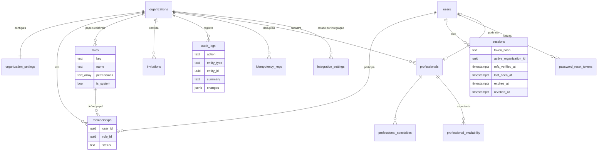
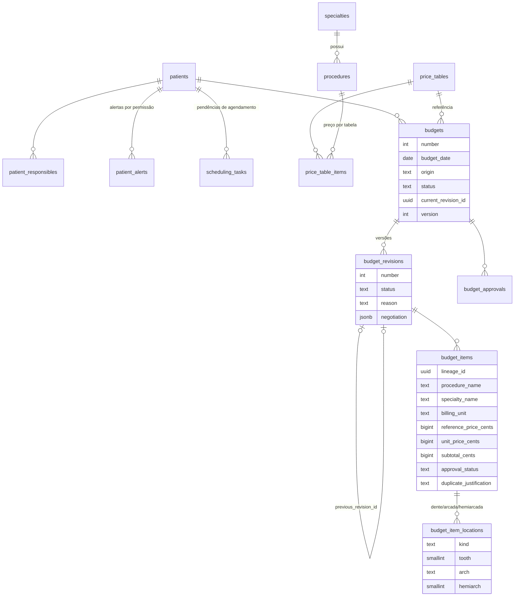
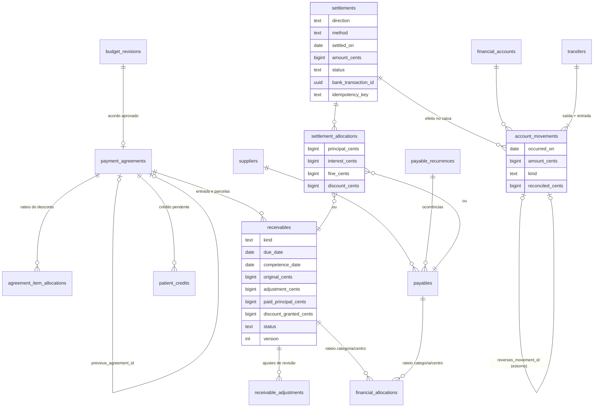
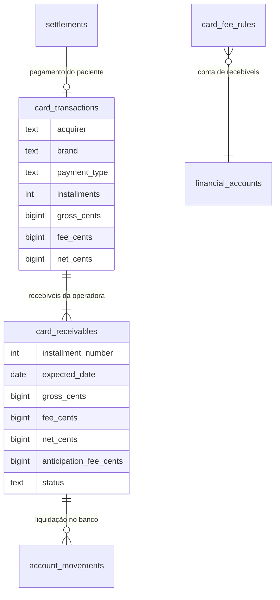
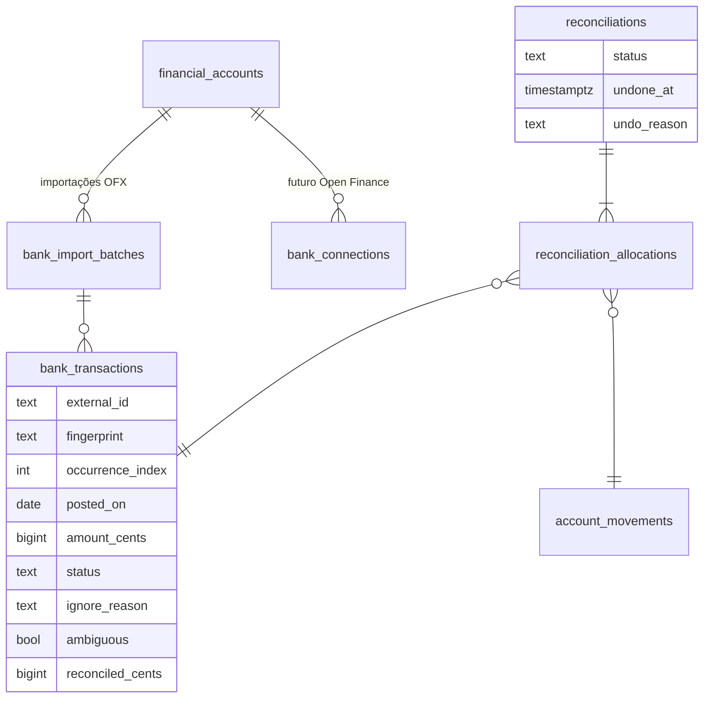
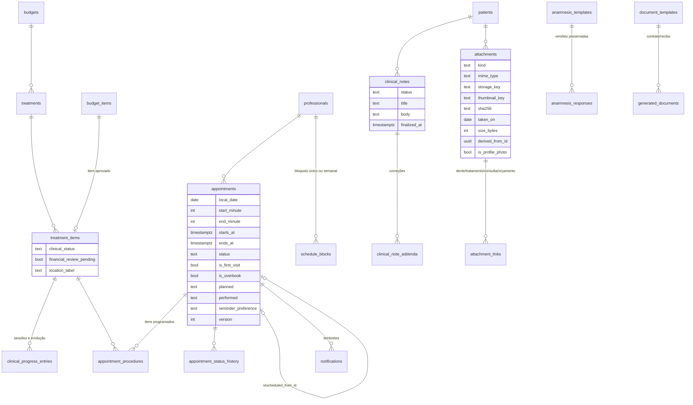

# Modelo de dados

Fonte da verdade: [`src/server/db/schema.ts`](../src/server/db/schema.ts) (70 tabelas) e as migrações em [`drizzle/`](../drizzle). Os diagramas abaixo mostram as entidades e relações essenciais por módulo; colunas de auditoria (`created_at`, `created_by`, `updated_at`…) e `organization_id` foram omitidas para leitura.

## Convenções

- **IDs**: UUID gerados no banco.
- **Tenant**: toda tabela de negócio tem `organization_id` e `unique (organization_id, id)`. FKs entre tabelas de negócio são compostas `(organization_id, x_id) → (organization_id, id)`: o banco recusa vínculos entre clínicas.
- **Dinheiro**: `bigint` em centavos (`*_cents`). Percentuais em pontos-base (`basis points`, 10% = 1000).
- **Datas civis** (`date`): vencimento, competência, data de baixa, data da consulta. **Instantes** (`timestamptz`): auditoria, início/fim de consulta.
- **Estados separados**: orçamento, item do orçamento, item de tratamento, consulta, título, liquidação e transação bancária têm cada um seu próprio campo de situação.
- **Histórico**: nada financeiro ou clínico é apagado; estornos, adendos, revisões e desfazer conciliação geram novos registros.

## Organização, acesso e auditoria

## Pacientes, catálogo e orçamento

- O item **copia** nome, especialidade, unidade, preço de referência e preço aplicado: alterar a tabela depois não muda orçamentos salvos.
- `reference_price_cents` nulo = procedimento sem preço cadastrado (diferente de zero = gratuidade deliberada).
- `lineage_id` liga o mesmo item entre revisões, para preservar tratamento e pagamentos.

## Acordo de pagamento, títulos e liquidações

- **Saldo do título** = `original + ajustes − principal recebido − desconto concedido`. Restrição `receivables_balance_ck` (e equivalente em `payables`) garante saldo ≥ 0 mesmo com baixas simultâneas.
- **Saldo da conta** = saldo inicial + soma de `account_movements` até a data. Títulos em aberto não alteram saldo realizado.

## Cartões

Não há coluna para número do cartão nem código de segurança.

## Extrato bancário e conciliação

- Deduplicação: índice único `(conta, external_id)` quando o banco envia FITID; sem FITID, `(conta, fingerprint, occurrence_index)` — duas transações reais idênticas recebem índices diferentes e ficam marcadas como ambíguas para revisão.
- `reconciled_cents` em transações e movimentos tem restrição `|conciliado| ≤ |valor|` com mesmo sinal: conciliação excedente falha no banco, inclusive concorrente.

## Tratamento, agenda e clínico

## Restrições de integridade além do ORM (`drizzle/0001_integrity_constraints.sql`)

| Restrição | Efeito |
|---|---|
| `appointments_no_overlap` (`EXCLUDE USING gist`) | Mesmo profissional não tem duas consultas ocupantes sobrepostas, salvo encaixe autorizado (`is_overbook`) |
| FKs circulares (`budgets_current_revision_fk`, `revisions_previous_fk`, `agreements_previous_fk`, `settlements_bank_tx_fk`, `movements_card_receivable_fk`, `movements_reverses_fk`) | Integridade entre versões, estornos e vínculos com extrato |
| `movements_reverses_once_uq` | Um movimento só pode ser estornado uma vez |
| Gatilho `prevent_final_clinical_note_update` | Registro clínico finalizado não é alterado nem excluído |
| Gatilho de auditoria somente-inclusão | `audit_logs` não aceita `UPDATE` nem `DELETE` |
